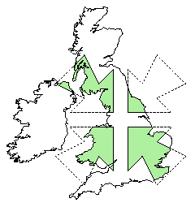
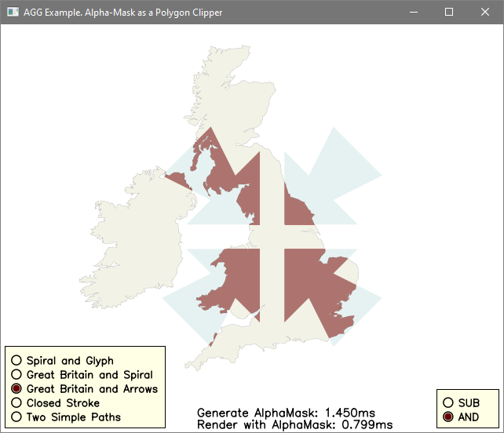

# [GPC – General Polygon Clipper](http://www.cs.man.ac.uk/~toby/gpc/)

The University of Manchester GPC library (wikipedia: [GPC](https://en.wikipedia.org/wiki/General_Polygon_Clipper)) is a flexible and highly robust polygon set operations library for use with C, C#, Delphi, Java, Perl, Python, Haskell, Lua, VB.Net (and other) applications.

**Information**

- Author: [Alan Murta](http://www.cs.man.ac.uk/~toby/alan/index.html)
- Wikipedia: https://en.wikipedia.org/wiki/General_Polygon_Clipper
- ~Website: http://www.cs.man.ac.uk/~toby/gpc/~
- Website (archive): https://web.archive.org/web/20200308234550/http://www.cs.man.ac.uk/~toby/gpc/
- ~Documentation: http://www.cs.man.ac.uk/~toby/alan/software/gpc.html~
- Documentation (archive): https://web.archive.org/web/20200323051343/http://www.cs.man.ac.uk/~toby/alan/software/gpc.html

**GPC Features**

- Difference, intersection, exclusive-or and union clip operations are supported.
- Polygons may be comprised of multiple disjoint contours.
- Contour vertices may be given in any order - clockwise or anticlockwise.
- Contours may be convex, concave or self-intersecting.
- Contours may be nested (i.e. polygons may have holes).
- Output may take the form of either polygon contours or tristrips.
- Hole and external contours are differentiated in the result.
- Coincident edges and degenerate regions are handled correctly.

**Demo**

>

>

**Contact**

Feel free to contact via [Twitter](https://twitter.com/vic4key) / [Gmail](mailto:vic4key@gmail.com) / [Blog](https://blog.vic.onl/) / [Website](https://vic.onl/)
